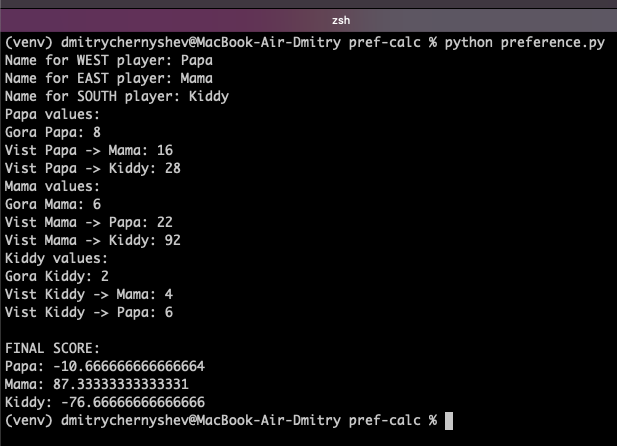
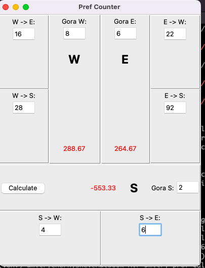

# pref-calc

This is a double-aimed project:
* Develop an application to calculate final score for Preference game (Russian Преферанс)
* Practice DevOps skills to initiate an agile software development project from scratch and run it through a few sprints with some valuable outcomes

## Project milestones

* MVP: a function to calculate final score, a CLI and a Tk UI to provide a player with the ability to utilize the function
* Sprint 2: a web service with `Flask` to provide the functionality. The Tk app is to use the web service.
* Sprint 3: a React FE application to replace the Tk UI
* Sprint 4: deploy both the web service and React FE to a cloud (GCP probably)

## Outcomes

A CLI:


A Tk UI:


## Tk tool usage

To run tkinter application, you need to install Tk for python first.
On MacOS you should do it the following way:

```bash
$ brew install python-tk
```

Then run the app:

```bash
$ python pref_ui.py
```
